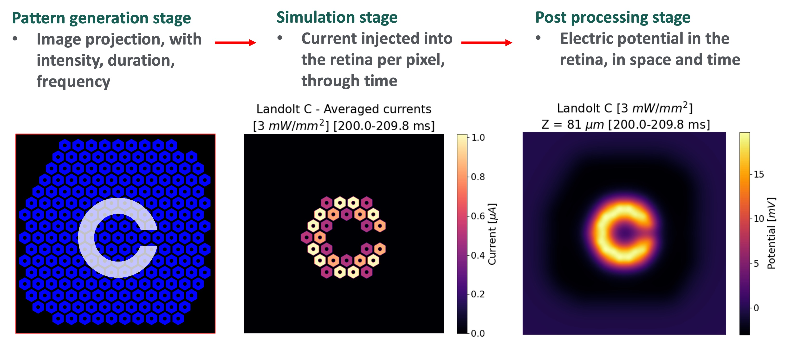
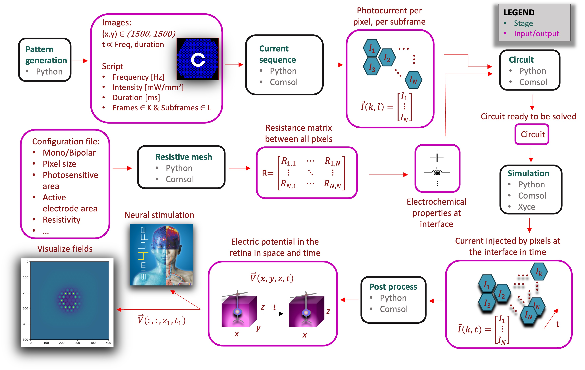

RPSIM TOOLBOX
-----------------
[](https://zenodo.org/badge/latestdoi/508075556)

[**RPSIM TOOLBOX**](https://github.com/PalankerLab/RPSim) is a software package designed to simulate the circuit 
dynamics of a photovoltaic retinal prosthetic (RP) with a large number of electrodes. 
This circuit takes the optical pattern projected onto the array as the input, and computes the electric current 
injection as a function of time for each electrode. Then, the currents are converted into an electric field characterized both in space and time throughout the retina.  




The time-varying electric field in the electrolyte is synthesized by linear superposition of the elementary fields pre-computed in [**COMSOL**](https://www.comsol.com/). 
These elementary fields, along with the description of the projection sequence, are required inputs for this tool. 
The kernel circuit simulator is [**Xyce**](https://xyce.sandia.gov/).

The toolbox is implemented in Python and intended to be interfaced via Jupyter Notebook. 

This software was developed by [**Charles Zhijie Chen**](https://web.stanford.edu/~zcchen/), [**Anna Kochnev Goldstein**](https://www.linkedin.com/in/anna-kochnev-goldstein/), [**Quentin Devaud**](www.linkedin.com/in/qdevaud), and  Nathan Jensen as part of the [**Photovoltaic Retinal Prosthesis Project**](https://web.stanford.edu/~palanker/lab/retinalpros.html) in [**Palanker Lab**](https://web.stanford.edu/~palanker/lab/index.html) at Stanford University. 
It can be adapted for similar applications, such as a non-photovoltaic retinal prosthesis or other multi-electrode 
arrays (MEA) used in neural stimulation.

## Software overview

The software processes a sequence of projected images defined by their duration, intensity, and frequency, which in turn induces an electric field in the retina through a photovoltaic subretinal implant. The computational process is divided into six distinct stages:  
1. Pattern generation stage
2. Current sequence stage
3. Resistive mesh stage
4. Circuit stage
5. Simulation stage
6. Post process stage  



The Pattern generation stage enables the creation of image patterns for projection onto the implant, incorporating precise pulse timing. This stage is optional, and users can opt to load predefined projection sequences. The output of this stage consists of the instructions for the projection sequence.

The Current sequence stage determines the photocurrent generated by each electrode, or pixel, over time for the specified projection sequence. These currents do not represent those injected into the retina; their computation is executed in the Simulation stage.

The Resistive mesh stage calculates the resistive mesh that interconnects each pixel in the array, relying on user-provided configurations (i.e. pixel size, geometry, bipolar vs monopolar, etc).

The Circuit stage assembles the circuit essential for computing the currents injected into the retina through the electrode-electrolyte interface. By combining additional user configurations with the outputs of the Current sequence and Resistive mesh stages, the Circuit stage creates an accurate representation of the implant's circuitry.

The Simulation stage employs Xyce to solve the circuit generated in the previous stage. The output comprises the currents injected in the retina, at the implant's surface, per pixel, and for each time point computed by Xyce.

The Post process stage computes how these currents generate a 3D electric potential throughout the retina, aided by precomputed elementary fields generated in COMSOL. The output is a four-dimensional matrix describing the potential in space and time.


## Installation
In order to use the toolbox, you can either download the package's zip file or clone the repository. 
*Please note that by downloading the zip you will be able to run the tool, but won't be able to use it as a git 
repository.
If you choose to download the toolbox using the "download" option*, you can skip ahead to step 3. Otherwise, please 
follow the steps below.

1. Install Git LFS:

   If Homebrew is not installed, first run (*Please note that Homebrew is a package manager for MacOS and Linux*):
   ```bash
   /bin/bash -c "$(curl -fsSL https://raw.githubusercontent.com/Homebrew/install/HEAD/install.sh)"
   ```
   
   And then execute:
   ```bash
   brew install git-lfs
   ```
   
   Check that the installation was successful:
   ```bash
   git lfs install
   ```

2. Using your terminal, clone the RPSim repository to the directory of your choice:

    ```bash
    cd <chosen directory>
   ```
   
   ```bash
    git clone https://github.com/PalankerLab/RPSim
   ```
   
   ```bash
    cd RPSim
    ```

3. Install Python:
   Download Python 3.9 or higher from the official website and follow the installation instructions: https://www.python.
   org/downloads/


4. Install Xyce:
   
   Download Xyce from the official website and follow the installation instructions: 
   **https://xyce.sandia.gov/downloads/Binaries.html** 
   
   Then, run the following to append the Xyce executable to the system PATH variable.
   Please make sure to adjust the version number in the command below to the downloaded executable.

   ```bash
   echo -e "\n export PATH=\"/usr/local/Xyce-Release-7.4.0-NORAD/bin:\$PATH\"" >> ~/.bash_profile
   ```
   
   ```bash
   source ~/.bash_profile
   ```
   
   If you run the following command, and get the executable path above in the output, this means the installation 
   was successful:
   ```bash
   which Xyce
   ```


5. Install Jupyter Notebook or Jupyter Lab: 
   
   If Homebrew is not installed, first run (*Please note that Homebrew is a package manager for MacOS and Linux*):
   ```bash
   /bin/bash -c "$(curl -fsSL https://raw.githubusercontent.com/Homebrew/install/HEAD/install.sh)"
   ```
  
   For Jupyter Lab, execute:
   ```bash
   brew install jupyterlab
   ```
   
   For Jupyter Notebook, execute:
   ```bash
   brew install jupyter
   ```
   
   *If you are not using MacOS/Linux or running into difficulties, you can also follow the instructions on the official 
   website: https://jupyter.org/install 


6. Go into the tool's main directory and run Jupyter Notebook:
   
   ```bash
    cd RPSim/
   ```

   If you installed Jupyter Notebook, execute:

   ```bash
    jupyter notebook
    ```
   
    If you installed Jupyter Lab, execute:

   ```bash
    jupyter-lab
   ```
   
    This step should open the Jupyter Notebook page in your default browser.


7. Now follow the instructions on the user_interface notebook page.

## User Interface
You can choose to update and edit the tool libraries to accommodate some advanced usages, but for basic applications 
users can interact with the tool only via the **user_interface.ipynb** (the user interface Jupyter Notebook) and the 
**user_files/user_input** directory, which contains the input files for the run.

Our toolbox comes with some initial input files, but these can be supplemented or replaced by any other user-defined input files. 

The output files will be generated in a dedicated output folder under the **user_files/user_output** directory. A new 
folder named with the execution date and time stamp will be created for each run. The prefix of the folder's name 
can be adjusted in the configuration section. The folder will include the execution log, the executed configuration in a .pkl format, the circuit simulation results and exemplary plots showing the currents and voltages for a central and an edge pixel.

## Configuration and Features
The execution of the tool can be configured from the user_interface notebook by changing the different Python dictionary entries. 

A sample section from a monpolar rat 20 µm pixel configuration is presented below:

   ```Python
   ## MP20 RAT CONFIGURATION

configuration = {}

# geometry-defined configuration
configuration["model"]                            = "monopolar"     # model geometry: monopolar or bipolar
configuration["pixel_size"]                       = 20           # pixel size
configuration["pixel_size_suffix"]                = ""         # If large format is required, use "-lg", else use ""
configuration["frame_width"]                      = 750       # implant radius in mm
configuration["geometry"]                         = "Flat_rat"  # geometry settings: HC/Pillar/Flat devices in
# pdish/rat/human
configuration["number_of_diodes"]                 = 1             # number of photo diodes per pixel
configuration["sirof_capacitance"]                = 6             # SIROF capacitance in mF/cm^2
configuration["photosensitive_area_edge_to_edge"] = 16           # edge-to-edge size of the photosensitive area
configuration["active_electrode_radius"]          = 4.5            # radius of the active electrode in um
configuration["light_to_current_conversion_rate"] = 0.5           # light to current conversion rate in A/W
configuration["photosensitive_area"]              = 158.085252133623   # total photosensitive area in um^2. Assign
# "None" for
# auto calculation

# R matrix parameters
configuration["r_matrix_output_file"]             = f'R_{configuration["geometry"]}_PS{configuration["pixel_size"]}{configuration["pixel_size_suffix"]}.pkl'
configuration["r_matrix_conductivity"]            = 1             # conductivity scaling factor of the electrolyte

# dynamic simulation configuration
configuration["Ipho_scaling"]                     = 1  # artificial scaling of photo current, useful for
                                                     # parametric sweep (e.g. S-D curve)
configuration["Isat"]                             = 0.3          # diode saturation current in pA
configuration["ideality_factor"]                  = 1.5          # ideality factor n of the diode
configuration["shunt_resistance"]                 = None         # shunt resistance in Ohm. Assign "None" if no shunt
configuration["initial_Vactive"]                  = 0.4          # Initial bias of the active electrode in V
configuration["temperature"]                      = 37
configuration["nominal_temperature"]              = 25
configuration["simulation_duration_sec"]          = 2.0             # simulation duration in seconds
configuration["simulation_resolution_ms"]         = None          # None defaults to Xyce inner value

# input paths
configuration["user_files_path"]                  = None          # If set to None, defaults to inner user_files directory
configuration["pixel_label_input_file"]           = f'image_sequence/pixel_label_PS{configuration["pixel_size"]}{configuration["pixel_size_suffix"]}.pkl'

   ```


#### 1. Multiplexing Configurations
Each configuration entry can be either assigned to a single value or a list of values. 

If a list is provided, each value in the list will be treated as a separate configuration entry, and all assembled 
configurations will be executed sequentially in a non-permuting manner. Therefore, all lists must have the same length. This feature enables multiple configurations be launched in one click by providing all requested values in a list form. 

For example, the notation presented below will be interpreted as two different configuration settings, where the 
first run will set the temperature to 25 and simulate for 1 second, and the second run to 37 and simulate for 2 
seconds.

   ```python
   configuration["temperature"]                      = [25, 37]
   configuration["nominal_temperature"]              = 25
   configuration["simulation_duration"]              = [1, 2]
   ```

#### 2. Input and Output Paths
Configuration entries that contains the keywords "input" and "output" will be identified as path-related variables. 
If a given input path is not found as a legitimate absolute path, then the tool will try interpreting the value as a 
relative path under the **user_files/user_input** directory. 
A time-stamped output directory will always be created as explained above. All output files will be placed under 
this directory.

#### 3. Projection sequence Parameters
This section contains the parameters defining the images or patterns, and how they are projected onto the implant, which is used in the Current sequence stage to compute the photo-current generated by each pixel (NOT the current injection 
into the electrolyte) as a function of time. If patterns are automatically generated set ```genreate_pattern=True``` and follow the instructions in the user_interface on how to automatically generate patterns. They are declared in a cell above the main configuration cell and passed as a list of ```ProjectionSequence``` to the main cell. If patterns are loaded from pre-existing projection sequences, please set ```generate_pattern=False``` and provide the name of the existing sequence in the ```video_sequence_name``` parameter. 

#### 4. Circuit Parameters
This section defines the circuit Xyce would simulate. For detailed explanation of the circuit model and the meaning 
of each parameter, please refer to the [Supplementary Materials](https://www.biorxiv.org/content/10.1101/2021.07.12.452093v2.supplementary-material) of our paper.
 
#### 5. Post processing Parameters
These parameters determine the resolution of the electric potential generation in space and time in the retina. Different layers along the vertical axis (depth layers) can be chosen for computation. The number of spatial slices depends on ```depth_values_in_um``` provided by the user. Each requested depth value is matched with the closest existing entry in the COMSOL pre-computed elementary fields.
The number of temporal slices depends on the  ```time_averaging_resolution_ms```, determining the width of the time window in which the currents per pixel are averaged. The number of time windows depends on the length of the pulse ```pulse_duration_in_ms``` divided by the time averaging resolution. If a single time point is desired for the entire pulse, please choose ```pulse_duration_in_ms = True```.
 The ``` interpolation_resolution_ms``` parameter influences how the Xyce generated currents are re-interpolated. Xyce's time *dynamic step size* can lead to non-existing data points in the time window of interest, resulting in non-continuous electric fields. Xyce's time step cannot be changed from dynamic to fixed. However, the maximal dynamic step size can be set to a certain value through the parameter: ``` simulation_resolution_ms ```. Please note that it may greatly increase the computation time of the Simulation stage, we recommend using the default value by entering ```None```. 

#### 6. Plotting Parameters 
The time parameters are used to plot the averaged currents per pixel in the time window provided and extract the closest time slice in the electric field at the depth provided by the user. 

## Execution
After proper adjustment of the configuration section, the tool is executed by running the configuration and 
execution section in the notebook:

   ```python
    from RPSim import run_rpsim

run_rpsim(configuration=configuration, find_previous_runs=True)
   ```

#### 1. Options
**run_stages** - This option enables to control which stages will be executed, defaults to the full flow:
["resistive_mesh", "current_sequence", "circuit", "simulation", "post_process", "plot_results"]. 
For instance, the run could extend until the Simulation stage, and then diffent Post process stage parameters could be explored. In order to run only the post_process stage and its plots, change the variable as follow: 

   ```python
    from RPSim import run_rpsim

run_rpsim(configuration=configuration, run_stages=["post_process", "plot_results"], find_previous_runs=True)
   ```

As the above flow is initialized midway, the tool will search for the latest available output for the previous 
stages under the user_files/user_output directory. If no previous runs are available, this will result in an error.

The list of stages can be cut at any desired stage, however skipping stages that rely on multiple outputs is 
currently not supported.  

**find_similar_runs** - This option enables the tool to check for existing configuration files in the 
**user_files/user_output** directory in order to issue a warning if the current configuration was already executed. 
It defaults to True.


## Feedback

Please do not hesitate to send us your feedback! 

We are an academic research group, and made this tool available for a collaborative community of scientific research.
If you found a bug, have improvement suggestions, or simply want to connect - please create a new issue or pull 
request, or contact our lab via the provided website!


## Related Publications
Please refer to the following publications for more information:

1. [Chen, Zhijie Charles, et al. "Photovoltaic implant simulator reveals resolution limits in subretinal prosthesis." Journal of neural engineering 19.5 (2022): 055008.](https://doi.org/10.1088/1741-2552/ac8ed8)
2. [Wang, Bing-Yi, et al. "Electronic photoreceptors enable prosthetic visual acuity matching the natural resolution in rats." Nature communications 13.1 (2022): 6627.](https://doi.org/10.1038/s41467-022-34353-y)

## License

MIT License

## Disclaimer
This package was created for our research purposes and distributed as an open source for the benefit of the 
scientific community. It is NOT intended for medical treatment or diagnosis and DOES NOT come with any kind of 
warranty. We hereby disclaim any liability related to the direct or indirect usage of this software.  


